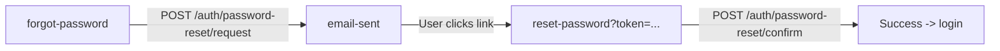

# ContaMind AI — Auth Module

Authentication and identity management flows: login, registration, two-factor authentication, passkeys, email verification, and password recovery.

---

## Routes

| Route | File | Description |
|---|---|---|
| `/auth/login` | `login/page.tsx` | Email/password login |
| `/auth/register` | `register/page.tsx` | 6-step registration wizard |
| `/auth/2fa` | `2fa/page.tsx` | TOTP / recovery-code verification |
| `/auth/passkeys` | `passkeys/page.tsx` | WebAuthn passkey registration and login |
| `/auth/forgot-password` | `forgot-password/page.tsx` | Request password reset email |
| `/auth/reset-password` | `reset-password/page.tsx` | Set new password via token |
| `/auth/verify-email` | `verify-email/page.tsx` | Token-based email verification |
| `/auth/email-sent` | `email-sent/page.tsx` | Confirmation after email sent |

---

## Auth Layout

Split-screen layout (`app/auth/layout.tsx`):

- **Left panel (45%, dark)**: ContaMind AI logo, rotating customer testimonials (5s interval). Hidden on `lg` breakpoint.
- **Right panel (55%, light)**: Theme toggle, form content via `{children}`.

---

## Login Flow

```mermaid
flowchart TD
    A[Login Page] --> B{Submit credentials}
    B -->|403| C[/auth/account-locked]
    B -->|500| D[/auth/error?code=...]
    B -->|2FA required| E[/auth/2fa?userId=...]
    B -->|Success| F[/dashboard]
```

Validation: Zod schema requires valid email + password. Shake animation on error. Auto-redirect if already authenticated.

---

## Registration Flow

6-step wizard:

| Step | Description |
|---|---|
| ACCOUNT | Name, email, password (12+ chars, complexity rules) + SSO |
| VERIFY_EMAIL | Polling-based email verification with cooldown |
| WORKSPACE | Personal/Empresa type, workspace name, RUC validation |
| ACTIVATION | SRI sync, file upload, demo data, or blank |
| LAUNCH | Invite teammates with roles |
| SUCCESS | Redirect to dashboard |

---

## Two-Factor Authentication

- 6-digit TOTP input with auto-advance
- Recovery mode toggle for backup codes
- Calls `useAuth().verify2FA(code, isRecoveryMode, userId)`
- Shake animation on invalid code

---

## Passkeys (WebAuthn)

Registration (requires authenticated session):

1. `POST /auth/webauthn/register/options` -- get challenge
2. `startRegistration()` -- browser biometric dialog
3. `POST /auth/webauthn/register/verify` -- verify attestation

Authentication (passwordless):

1. `POST /auth/webauthn/authenticate/options` -- get challenge
2. `startAuthentication()` -- browser passkey dialog
3. `POST /auth/webauthn/authenticate/verify` -- verify assertion

---

## Password Recovery



---

## Component Dependencies

| Component | Path | Purpose |
|---|---|---|
| `PasswordStrength` | `components/auth/PasswordStrength` | Password strength meter |
| `CooldownTimer` | `components/auth/CooldownTimer` | Resend cooldown logic |
| `AuthNotification` | `components/auth/AuthNotification` | Error/success alerts |
| `EmailSentCard` | `components/auth/EmailSentCard` | Email-sent confirmation |
| `VerificationStatus` | `components/auth/VerificationStatus` | Verification state display |

---

## Backend Integration

| Endpoint | Method | Purpose |
|---|---|---|
| `/auth/login` | POST | Authenticate |
| `/auth/register` | POST | Create account |
| `/auth/email-verification/verify` | POST | Verify email token |
| `/auth/email-verification/resend` | POST | Resend verification |
| `/auth/password-reset/request` | POST | Request reset link |
| `/auth/password-reset/confirm` | POST | Confirm new password |
| `/auth/2fa/verify` | POST | Verify TOTP/backup code |
| `/auth/webauthn/register/options` | POST | WebAuthn registration options |
| `/auth/webauthn/register/verify` | POST | Verify WebAuthn attestation |
| `/auth/webauthn/authenticate/options` | POST | WebAuthn auth options |
| `/auth/webauthn/authenticate/verify` | POST | Verify WebAuthn assertion |
